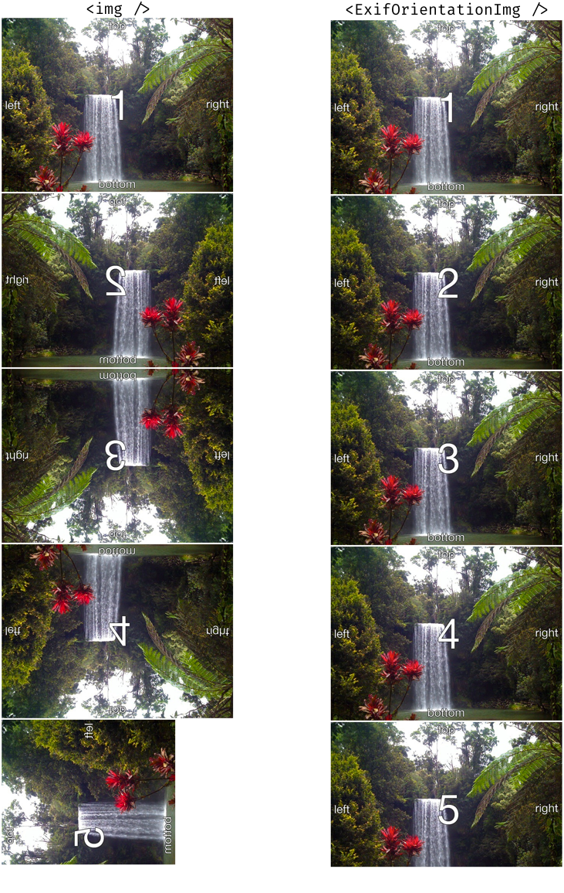

# react-exif-orientation-img

`img` element wrapper component for React that understands EXIF orientation information and corrects it using CSS transforms.



## Installation

```sh
npm install --save react-exif-orientation-img
# or
yarn add react-exif-orientation-img
```

We do not bundle the source for now. If you are using Create React App or a similar Babel preset, everything should work as expected.

## Usage

Instead of using an `img` element, use this component instead:

```js
import React from 'react';
import ExifOrientationImg from 'react-exif-orientation-img'

const MyComponent = () =>
  <ExifOrientationImg
    src="https://github.com/recurser/exif-orientation-examples/blob/master/Portrait_8.jpg?raw=true"
    alt="A waterfall"
  />
```

All properties will be cleanly passed to the img element including `style` and `onLoad` that this component uses under the hood. However, **keep in mind that you should be aware that width/height and other dimension manipulations may not work as expected**.

## Roadmap

- Add a container system to wrap correctly the image dimensions
- Package this library using a manual webpack configuration
